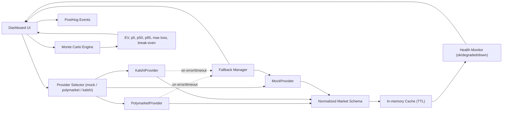

# ProbEdge — Prediction Market Research Suite

A multi-tool suite for analyzing sportsbook vs prediction market pricing, running Monte Carlo hedge simulations, and exploring event contract risk.

## Live Demo
[market-hedge-simulator.replit.app](https://market-hedge-simulator.replit.app)

## Tools

| Page | What it does |
|---|---|
| Event Markets Intelligence | Contract grid with risk/type filters |
| Sportsbook Hedge Simulator | Monte Carlo simulation with seeded RNG, presets, shareable URLs |
| Probability Gap Dashboard | Odds to implied prob vs live market price, gap + EV analysis |
| Event Contract Library | Full contract catalog with search, detail view, add/delete |

## Architecture



## Data Model (Normalized)

All providers map into one shared schema before UI/metrics consume data:

- `event_id`
- `title`
- `outcomes`
- `price`
- `implied_prob`
- `source`
- `updated_at`

## Provider Layer

- `MockProvider`: default safe fallback for local/demo reliability
- `PolymarketProvider`: live prediction market prices
- `KalshiProvider`: live event contract prices
- Fallback chain: selected provider -> `MockProvider` on timeout/error/rate-limit
- Cache: short TTL to reduce noise and avoid unnecessary provider calls
- Health states:
  - `ok`: fresh data within threshold
  - `degraded`: stale cache served after provider issue
  - `down`: no usable data + active provider failures

## v1.2 Simulation Engine

`core/` contains the v1.2 engine with full liquidity-aware Monte Carlo:

| Module | Purpose |
|---|---|
| `core/types_v12.py` | Dataclasses: `SimulationInputV12`, `StrategyMetrics`, `LiquidityModel`, `InternalRepriceModel`, `RiskTransferCurve` |
| `core/liquidity.py` | Hedge cap, market impact delta, effective cost rate |
| `core/metrics.py` | CVaR at configurable alpha |
| `core/strategies.py` | `external_hedge`, `internal_reprice`, `hybrid` implementations |
| `core/optimizer.py` | Grid-search optimizer + `build_risk_transfer_curve` |

**Strategies:**
- `external_hedge`: buys YES contracts on prediction market, capped by `LiquidityModel`
- `internal_reprice`: moves the offered line to reduce handle, models demand decay via `handle_retention_decay`
- `hybrid`: partial reprice first, then external hedge on residual liability

**Objectives:** `min_cvar`, `min_max_loss`, `max_sharpe`, `target_ev_min_risk`

## Reliability Guarantees

### Deterministic replay

Every v1.2 API response includes a `scenario` object:

```json
"scenario": {
  "seed": "my-run-42",
  "n_paths": 3000,
  "fill_probability": 0.85,
  "liquidity": null,
  "timestamp_utc": "2026-03-05T18:00:00+00:00"
}
```

Passing the same `seed`, `n_paths`, and `fill_probability` back to the endpoint will reproduce the exact same paths and metrics. Results are bit-for-bit identical across reruns.

### Provider fallback and circuit breaker

Requests to Polymarket or Kalshi follow this chain:

1. Serve from in-memory cache if TTL has not elapsed
2. Fetch fresh data from the upstream provider
3. On error: increment consecutive error counter and serve stale cache
4. After **3 consecutive errors**: open circuit — upstream is skipped entirely and stale cache is served immediately, with no further outbound calls
5. Backoff is exponential (10 s → 20 s → 40 s → 80 s → 120 s cap)
6. Circuit resets automatically on the first successful fetch

Provider health is visible at `/api/providers/health` and reflected in the footer status dots on every page.

### Stale-cache behavior

- Data served from cache that is older than 5 minutes is flagged `stale: true` in the health response
- The Probability Gap Dashboard shows a warning indicator when stale data is being displayed
- Stale data is always preferred over returning an error to the caller

## Analytics

Set `POSTHOG_KEY` in Replit Secrets to enable event ingestion.

Client-side events:
- `run_started` — hedging simulator form submit
- `run_completed` — successful simulation response
- `provider_selected` — probability gap provider switch
- `provider_fallback_triggered` — fallback to mock served

Server-side events (fired from API layer, independent of browser):
- `v12_simulation_run` — every `/simulate/v12` call with strategy, objective, n_paths, and `distribution_collapsed` flag
- `risk_transfer_curve_requested` — every `/api/risk-transfer` call with strategy, objective, and `any_collapsed` flag

## Environment Variables

- `POSTHOG_KEY` - PostHog project API key
- provider-specific keys/base URLs as required by your adapters

## Quality / Testing

Current automated test status: **64/64 passing**.

Coverage includes:
- deterministic simulation behavior
- analytical EV parity checks
- slippage monotonicity
- provider mapping (Polymarket/Kalshi)
- timeout fallback behavior
- stale-data health transitions
- circuit breaker: opens at threshold, skips inner while open, resets on success, backoff growth
- hedge cap enforcement (liquidity-bounded effective notional)
- impact_factor monotonicity on EV
- risk transfer curve non-decreasing hedge ratio under `min_cvar`
- CVaR tail mean correctness (not percentile proxy)
- v12 determinism across all three strategy modes
- strategy comparison with shared seed

## Local Development

```bash
git clone <repo-url>
pip install fastapi uvicorn numpy requests matplotlib
uvicorn catalog_app:app --host 0.0.0.0 --port 5000
```

Run tests:
```bash
python3 -m pytest tests/ -v
```

## API

```
GET  /api/markets?source=mock|polymarket|kalshi&limit=N
GET  /api/markets/{event_id}?source=...
GET  /api/providers/health
GET  /api/config
GET  /api/contracts
POST /api/contracts
GET  /api/contracts/{id}
DELETE /api/contracts/{id}
POST /simulate
POST /simulate/v12
POST /simulate/v12/curve
GET  /api/risk-transfer?strategy=&objective=&liabilities=&stake=&american_odds=&true_win_prob=&fill_probability=&n_paths=&seed=
GET  /status
```


## Article Reproduction

The canonical article scenario can be reproduced exactly from the live app or via the API.

### Loading in the UI

Navigate to the Event Markets Intelligence page with the query parameter:

```
https://market-hedge-simulator.replit.app/event-markets?scenario=superbowl_v1
```

The page will auto-load the Super Bowl preset and run the Monte Carlo engine with a fixed seed,
producing identical curves to those published in the article.

### Reproducing via API

```bash
curl -s -X POST https://market-hedge-simulator.replit.app/api/risk-transfer/interactive \
  -H "Content-Type: application/json" \
  -d '{
    "strategy_modes": ["external_hedge", "internal_reprice", "hybrid"],
    "objective": "min_cvar",
    "liabilities": [500, 1000, 2000, 4000, 8000],
    "base_input": {
      "stake": 100,
      "american_odds": -110,
      "true_win_prob": 0.54,
      "fill_probability": 0.85,
      "slippage_bps": 8,
      "fee_bps": 2,
      "latency_bps": 3,
      "n_paths": 500,
      "seed": "superbowl_v1",
      "liquidity": {
        "available_liquidity": 1000000,
        "participation_rate": 0.2,
        "impact_factor": 0.6,
        "depth_exponent": 1.0
      }
    }
  }' | python3 -m json.tool
```

### Sample Response (truncated)

```json
{
  "scenario": {
    "seed": "superbowl_v1",
    "n_paths": 500,
    "fill_probability": 0.85,
    "timestamp_utc": "2026-03-05T00:00:00Z"
  },
  "objective": "min_cvar",
  "series": [
    {
      "strategy": "external_hedge",
      "points": [
        { "liability": 500,  "optimal_hedge_ratio": 0.45, "ev": -12.3, "cvar_95": -48.1, "max_loss": -52.0, "distribution_collapsed": false },
        { "liability": 1000, "optimal_hedge_ratio": 0.50, "ev": -24.6, "cvar_95": -91.3, "max_loss": -104.0, "distribution_collapsed": false }
      ]
    }
  ]
}
```

### Tail-Risk Distribution

To fetch the unhedged vs hedged P&L distribution for a single liability point:

```bash
curl -s -X POST https://market-hedge-simulator.replit.app/api/risk-transfer/distribution \
  -H "Content-Type: application/json" \
  -d '{
    "strategy": "external_hedge",
    "liability": 2000.0,
    "hedge_fraction": 0.5,
    "base_input": { "stake": 100, "american_odds": -110, "true_win_prob": 0.54,
                    "fill_probability": 0.85, "n_paths": 500, "seed": "superbowl_v1",
                    "slippage_bps": 8, "fee_bps": 2, "latency_bps": 3,
                    "liquidity": { "available_liquidity": 1000000, "participation_rate": 0.2,
                                   "impact_factor": 0.6, "depth_exponent": 1.0 } }
  }'
```

Returns `unhedged` and `hedged` histogram objects with `bin_mids`, `counts`, `ev`, `cvar_95`, and `max_loss`.

### Chart Interpretation

- **Primary curve**: each line is a strategy (External Hedge / Internal Reprice / Hybrid); X-axis is sportsbook liability in dollars; Y-axis is the selected metric (EV, CVaR-95, Max Loss, or Optimal Hedge Ratio) at the liability level that minimises CVaR-95
- **Tail-risk overlay**: semi-transparent bars show the P&L distribution across all Monte Carlo paths — red = unhedged, blue = hedged; CVaR annotations mark the 5th-percentile tail mean
- **Determinism**: results are identical across runs when using the same `seed` string (MD5-mapped to a 32-bit integer for NumPy's default RNG)

### Objectives

| Objective | Score function | Best for |
|---|---|---|
| `max_ev` | `metrics.ev` | Maximize expected return from hedging |
| `min_cvar` | `metrics.cvar_95` | Risk-averse books; minimise tail-loss exposure |
| `min_max_loss` | `metrics.max_loss` | Hard floor on worst-case scenario |
| `max_sharpe` | `metrics.ev / (p95 - p5)` | Risk-adjusted return optimisation |
| `target_ev_min_risk` | `cvar_95` if `ev ≥ 0` else `-∞` | Only hedge when EV is non-negative |

**Note**: `min_cvar` with `fill_probability < 1.0` often returns `hf=0` because unfilled hedge paths anchor the CVaR tail regardless of hedge fraction. Use `max_ev` for the most informative curves.

Each point in the response also includes `unhedged_paths` and `hedged_paths` — the raw per-path P&L arrays (500 values each) for building your own histogram overlays client-side.

### Limitations

- `n_paths` is capped at 500 on the interactive endpoint and 2000 on the distribution endpoint to bound server latency
- Liquidity model uses a power-law market-impact function; real slippage curves may differ
- Internal Reprice strategy does not model competitor re-entry after odds move
- Fill probability is treated as i.i.d. per path; correlated order-book dynamics are not modelled
