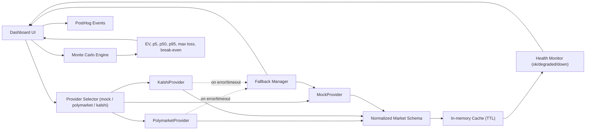

# ProbEdge — Prediction Market Research Suite

A multi-tool suite for analyzing sportsbook vs prediction market pricing, running Monte Carlo hedge simulations, and exploring event contract risk.

## Live Demo
[market-hedge-simulator.replit.app](https://market-hedge-simulator.replit.app)

## Tools

| Page | What it does |
|---|---|
| Event Markets Intelligence | Contract grid with risk/type filters |
| Sportsbook Hedge Simulator | Monte Carlo simulation with seeded RNG, presets, shareable URLs |
| Probability Gap Dashboard | Odds to implied prob vs live market price, gap + EV analysis |
| Event Contract Library | Full contract catalog with search, detail view, add/delete |

## Architecture



## Data Model (Normalized)

All providers map into one shared schema before UI/metrics consume data:

- `event_id`
- `title`
- `outcomes`
- `price`
- `implied_prob`
- `source`
- `updated_at`

## Provider Layer

- `MockProvider`: default safe fallback for local/demo reliability
- `PolymarketProvider`: live prediction market prices
- `KalshiProvider`: live event contract prices
- Fallback chain: selected provider -> `MockProvider` on timeout/error/rate-limit
- Cache: short TTL to reduce noise and avoid unnecessary provider calls
- Health states:
  - `ok`: fresh data within threshold
  - `degraded`: stale cache served after provider issue
  - `down`: no usable data + active provider failures

## v1.2 Simulation Engine

`core/` contains the v1.2 engine with full liquidity-aware Monte Carlo:

| Module | Purpose |
|---|---|
| `core/types_v12.py` | Dataclasses: `SimulationInputV12`, `StrategyMetrics`, `LiquidityModel`, `InternalRepriceModel`, `RiskTransferCurve` |
| `core/liquidity.py` | Hedge cap, market impact delta, effective cost rate |
| `core/metrics.py` | CVaR at configurable alpha |
| `core/strategies.py` | `external_hedge`, `internal_reprice`, `hybrid` implementations |
| `core/optimizer.py` | Grid-search optimizer + `build_risk_transfer_curve` |

**Strategies:**
- `external_hedge`: buys YES contracts on prediction market, capped by `LiquidityModel`
- `internal_reprice`: moves the offered line to reduce handle, models demand decay via `handle_retention_decay`
- `hybrid`: partial reprice first, then external hedge on residual liability

**Objectives:** `min_cvar`, `min_max_loss`, `max_sharpe`, `target_ev_min_risk`

## Analytics

Set `POSTHOG_KEY` in Replit Secrets to enable event ingestion.

Tracked events:
- `run_started`
- `run_completed`
- `provider_selected`
- `provider_fallback_triggered`

## Environment Variables

- `POSTHOG_KEY` - PostHog project API key
- provider-specific keys/base URLs as required by your adapters

## Quality / Testing

Current automated test status: **50/50 passing**.

Coverage includes:
- deterministic simulation behavior
- analytical EV parity checks
- slippage monotonicity
- provider mapping (Polymarket/Kalshi)
- timeout fallback behavior
- stale-data health transitions
- hedge cap enforcement (liquidity-bounded effective notional)
- impact_factor monotonicity on EV
- risk transfer curve non-decreasing hedge ratio under `min_cvar`
- CVaR tail mean correctness

## Local Development

```bash
git clone <repo-url>
pip install fastapi uvicorn numpy requests
uvicorn catalog_app:app --host 0.0.0.0 --port 5000
```

Run tests:
```bash
python3 -m pytest tests/ -v
```

## API

```
GET  /api/markets?source=mock|polymarket|kalshi&limit=N
GET  /api/markets/{event_id}?source=...
GET  /api/providers/health
GET  /api/config
GET  /api/contracts
POST /api/contracts
GET  /api/contracts/{id}
DELETE /api/contracts/{id}
POST /simulate
POST /simulate/v12
POST /simulate/v12/curve
GET  /status
```
