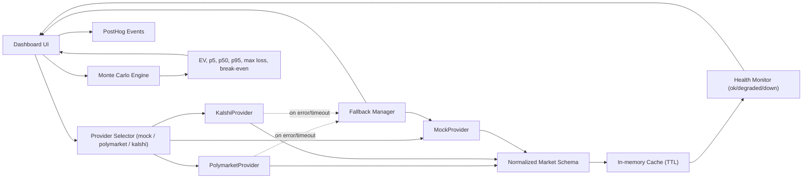

# ProbEdge — Prediction Market Research Suite

A multi-tool suite for analyzing sportsbook vs prediction market pricing, running Monte Carlo hedge simulations, and exploring event contract risk.

## Live Demo
[market-hedge-simulator.replit.app](https://market-hedge-simulator.replit.app)

## Tools

| Page | What it does |
|---|---|
| Event Markets Intelligence | Contract grid with risk/type filters |
| Sportsbook Hedge Simulator | Monte Carlo simulation with seeded RNG, presets, shareable URLs |
| Probability Gap Dashboard | Odds to implied prob vs live market price, gap + EV analysis |
| Event Contract Library | Full contract catalog with search, detail view, add/delete |

## Architecture



## Data Model (Normalized)

All providers map into one shared schema before UI/metrics consume data:

- `event_id`
- `title`
- `outcomes`
- `price`
- `implied_prob`
- `source`
- `updated_at`

## Provider Layer

- `MockProvider`: default safe fallback for local/demo reliability
- `PolymarketProvider`: live prediction market prices
- `KalshiProvider`: live event contract prices
- Fallback chain: selected provider -> `MockProvider` on timeout/error/rate-limit
- Cache: short TTL to reduce noise and avoid unnecessary provider calls
- Health states:
  - `ok`: fresh data within threshold
  - `degraded`: stale cache served after provider issue
  - `down`: no usable data + active provider failures

## v1.2 Simulation Engine

`core/` contains the v1.2 engine with full liquidity-aware Monte Carlo:

| Module | Purpose |
|---|---|
| `core/types_v12.py` | Dataclasses: `SimulationInputV12`, `StrategyMetrics`, `LiquidityModel`, `InternalRepriceModel`, `RiskTransferCurve` |
| `core/liquidity.py` | Hedge cap, market impact delta, effective cost rate |
| `core/metrics.py` | CVaR at configurable alpha |
| `core/strategies.py` | `external_hedge`, `internal_reprice`, `hybrid` implementations |
| `core/optimizer.py` | Grid-search optimizer + `build_risk_transfer_curve` |

**Strategies:**
- `external_hedge`: buys YES contracts on prediction market, capped by `LiquidityModel`
- `internal_reprice`: moves the offered line to reduce handle, models demand decay via `handle_retention_decay`
- `hybrid`: partial reprice first, then external hedge on residual liability

**Objectives:** `min_cvar`, `min_max_loss`, `max_sharpe`, `target_ev_min_risk`

## Reliability Guarantees

### Deterministic replay

Every v1.2 API response includes a `scenario` object:

```json
"scenario": {
  "seed": "my-run-42",
  "n_paths": 3000,
  "fill_probability": 0.85,
  "liquidity": null,
  "timestamp_utc": "2026-03-05T18:00:00+00:00"
}
```

Passing the same `seed`, `n_paths`, and `fill_probability` back to the endpoint will reproduce the exact same paths and metrics. Results are bit-for-bit identical across reruns.

### Provider fallback and circuit breaker

Requests to Polymarket or Kalshi follow this chain:

1. Serve from in-memory cache if TTL has not elapsed
2. Fetch fresh data from the upstream provider
3. On error: increment consecutive error counter and serve stale cache
4. After **3 consecutive errors**: open circuit — upstream is skipped entirely and stale cache is served immediately, with no further outbound calls
5. Backoff is exponential (10 s → 20 s → 40 s → 80 s → 120 s cap)
6. Circuit resets automatically on the first successful fetch

Provider health is visible at `/api/providers/health` and reflected in the footer status dots on every page.

### Stale-cache behavior

- Data served from cache that is older than 5 minutes is flagged `stale: true` in the health response
- The Probability Gap Dashboard shows a warning indicator when stale data is being displayed
- Stale data is always preferred over returning an error to the caller

## Analytics

Set `POSTHOG_KEY` in Replit Secrets to enable event ingestion.

Client-side events:
- `run_started` — hedging simulator form submit
- `run_completed` — successful simulation response
- `provider_selected` — probability gap provider switch
- `provider_fallback_triggered` — fallback to mock served

Server-side events (fired from API layer, independent of browser):
- `v12_simulation_run` — every `/simulate/v12` call with strategy, objective, n_paths, and `distribution_collapsed` flag
- `risk_transfer_curve_requested` — every `/api/risk-transfer` call with strategy, objective, and `any_collapsed` flag

## Environment Variables

- `POSTHOG_KEY` - PostHog project API key
- provider-specific keys/base URLs as required by your adapters

## Quality / Testing

Current automated test status: **64/64 passing**.

Coverage includes:
- deterministic simulation behavior
- analytical EV parity checks
- slippage monotonicity
- provider mapping (Polymarket/Kalshi)
- timeout fallback behavior
- stale-data health transitions
- circuit breaker: opens at threshold, skips inner while open, resets on success, backoff growth
- hedge cap enforcement (liquidity-bounded effective notional)
- impact_factor monotonicity on EV
- risk transfer curve non-decreasing hedge ratio under `min_cvar`
- CVaR tail mean correctness (not percentile proxy)
- v12 determinism across all three strategy modes
- strategy comparison with shared seed

## Local Development

```bash
git clone <repo-url>
pip install fastapi uvicorn numpy requests matplotlib
uvicorn catalog_app:app --host 0.0.0.0 --port 5000
```

Run tests:
```bash
python3 -m pytest tests/ -v
```

## API

```
GET  /api/markets?source=mock|polymarket|kalshi&limit=N
GET  /api/markets/{event_id}?source=...
GET  /api/providers/health
GET  /api/config
GET  /api/contracts
POST /api/contracts
GET  /api/contracts/{id}
DELETE /api/contracts/{id}
POST /simulate
POST /simulate/v12
POST /simulate/v12/curve
POST /api/tier2/frontier
POST /api/tier2/feasibility
GET  /api/risk-transfer?strategy=&objective=&liabilities=&stake=&american_odds=&true_win_prob=&fill_probability=&n_paths=&seed=
GET  /status
```

## Tier 2 (IDs 09–14)

### Paper Mode behavior

The Event Markets page includes a `Paper / Explore` toggle in the control bar.

- Paper mode applies these locked defaults:
  - `liability=100000000`
  - `liquidity=20000000`
  - `true_probability=0.55`
  - `market_price=0.52`
  - `target_hedge_ratio=0.60`
  - `simulation_count=10000`
- While Paper mode is active, the six control sliders/inputs are disabled.
- Switching back to Explore restores the exact pre-Paper Explore values.

### URL serialization format

The six Tier 2 controls are synchronized to the URL query string with ~300ms debounce:

- `liability` -> `liability`
- `liquidity` -> `liquidity`
- `true_probability` -> `p`
- `market_price` -> `price`
- `target_hedge_ratio` -> `hedge`
- `simulation_count` -> `n`

Load behavior:
- Full query: initializes all six controls from URL.
- Partial query: missing keys use defaults.
- Invalid values: silently fall back to defaults.

### Figure 4 interpretation

`Figure 4 — Hedging Efficiency Frontier` plots two frontiers (`shallow`, `deep`) built by sweeping `hedge_ratio` from `0.00` to `1.00` in `0.05` increments.

Per point:
- `ev_sacrificed = EV_unhedged - EV_hedged`
- `tail_reduction = EWCL_unhedged - EWCL_hedged`

Hover fields:
- Hedge Size
- Liquidity Used
- EV Change
- Tail-Risk Improvement

`deep` is constrained to be on/above `shallow` on tail-risk improvement.

### Figure 5 interpretation

`Figure 5 — Sportsbook Hedging Feasibility Map` is a 20x20 liquidity-vs-liability region map:

- Liability axis: `20M -> 200M`
- Liquidity axis: `1M -> 100M`
- Effective hedge: `h_eff = min(target_hedge_ratio, Q/L)`
- Regions:
  - `<0.10` -> `No Effective Hedging`
  - `<0.40` -> `Partial Hedging`
  - `>=0.40` -> `Meaningful Hedging`

A crosshair is drawn at the current global `(liability, liquidity)` and updates with control changes.
