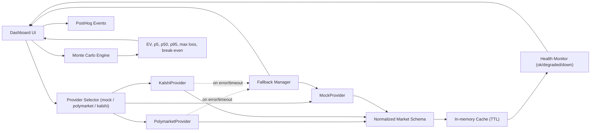

# ProbEdge — Prediction Market Research Suite

A multi-tool suite for analyzing sportsbook vs prediction market pricing, running Monte Carlo hedge simulations, and exploring event contract risk.

## Live Demo
[market-hedge-simulator.replit.app](https://market-hedge-simulator.replit.app)

## Tools

| Page | What it does |
|---|---|
| Event Markets Intelligence | Contract grid with risk/type filters |
| Sportsbook Hedge Simulator | Monte Carlo simulation with seeded RNG, presets, shareable URLs |
| Probability Gap Dashboard | Odds → implied prob vs live market price, gap + EV analysis |
| Event Contract Library | Full contract catalog with search, detail view, add/delete |

## Architecture



Provider interface (`providers/base.py`):
- `get_markets(limit)` → `List[MarketData]`
- `get_prices(event_id)` → `Optional[MarketData]`
- `get_timestamp()` → `str`

Normalized schema (`MarketData`):
`event_id` · `title` · `outcomes` · `price` · `implied_prob` · `source` · `updated_at` · `volume` · `end_date`

## Outputs (Hedge Simulator)
- Expected value (EV)
- P/L distribution (p5, p50, p95)
- Maximum loss
- Break-even win rate
- Deterministic run ID (MD5 of inputs)
- Shareable URL (all inputs as query params)

## Tech
- **Backend**: Python 3.11 + FastAPI + SQLite
- **Simulation**: NumPy Monte Carlo (seeded RNG, 10 inputs)
- **Providers**: Polymarket CLOB (public API), Kalshi trading API, MockProvider
- **Cache**: In-memory TTL with stale-data fallback + health tracking
- **Analytics**: PostHog (via `POSTHOG_KEY` env var; falls back to console if not set)
- **Frontend**: Vanilla HTML/CSS/JS, Plotly charts

## Tests

```
32/32 passing

tests/test_simulator.py    — EV parity, seed determinism, slippage monotonicity
tests/test_providers.py    — schema mapping (Polymarket + Kalshi), MockProvider,
                             API failure fallback, cache TTL, timeout fallback,
                             stale health status
```

Run tests:
```bash
python3 -m pytest tests/ -v
```

## Local Development

```bash
git clone <repo-url>
pip install fastapi uvicorn numpy requests
uvicorn catalog_app:app --host 0.0.0.0 --port 5000
```

## Environment Setup

| Variable | Required | Description |
|---|---|---|
| `POSTHOG_KEY` | No | PostHog project API key for analytics events |
| `POLYMARKET_API_BASE` | No | Override Polymarket CLOB base URL (default: `https://clob.polymarket.com`) |
| `KALSHI_API_BASE` | No | Override Kalshi API base URL |
| `KALSHI_API_KEY` | No | Kalshi auth token for authenticated endpoints |

## Analytics Events

When `POSTHOG_KEY` is set, the following events are tracked:

| Event | When |
|---|---|
| `run_started` | Simulation submitted |
| `run_completed` | Simulation results returned |
| `provider_selected` | User switches data source |
| `provider_fallback_triggered` | Selected provider failed, serving mock data |

## API

```
GET  /api/markets?source=mock|polymarket|kalshi&limit=N
GET  /api/markets/{event_id}?source=...
GET  /api/providers/health
GET  /api/config
GET  /api/contracts
POST /api/contracts
GET  /api/contracts/{id}
DELETE /api/contracts/{id}
POST /simulate
GET  /status
```
